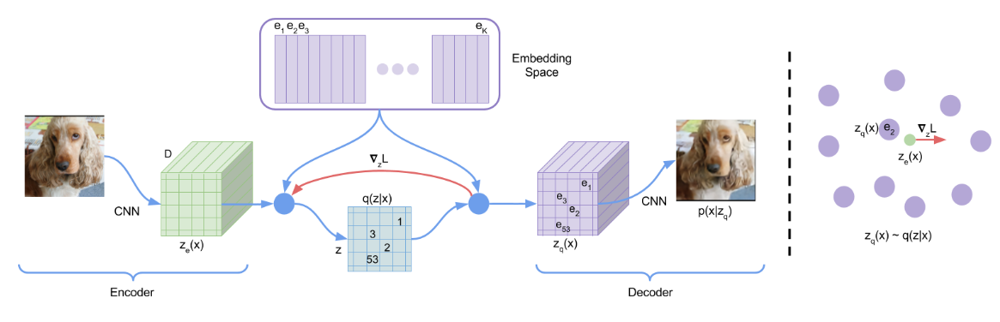
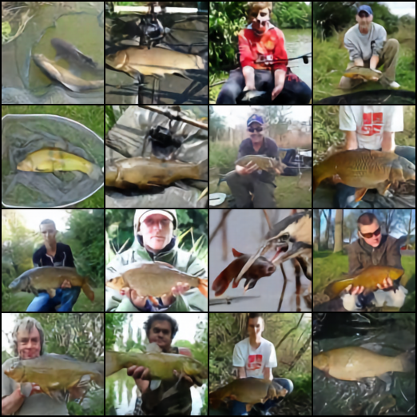

# VQ-VAE

## Overview
This is an unofficial PyTorch implementation of the following paper:

> **Neural Discrete Representation Learning**<br>
> Aaron van den Oord, Oriol Vinyals, Koray Kavukcuoglu <br>
> https://arxiv.org/abs/1711.00937

## Usage
Following command train the model
```bash
accelerate launch train.py
```

## Results
Trained VQ-VAE on 4 GPUs and the reconstruction images are shown below.


