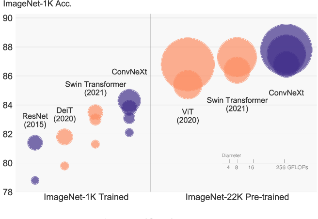

# ConvNeXt



## Overview
This is an unofficial PyTorch implementation of the following paper:

> **A ConvNet for the 2020s** <br>
> Zhuang Liu, Hanzi Mao, Chao-Yuan Wu, Christoph Feichtenhofer, Trevor Darrell, Saining Xie <br>
> https://arxiv.org/pdf/2201.03545.pdf

## TODO
- Add data augmentation such as MixUp / CutMix...
- Stohastic Depth
- Layer Scale
- use EMA

## Usage
Following command train the model
```bash
accelerate launch train.py
```

## Experiments
All models were trained with the default parameters except model architecture.

| Model | Top-1 acc. | Top-5 acc. |
| ---   |     :---:      |   :---: |
| ConvNeXt-T |      |     |
| ConvNeXt-S |      |     |
| ConvNeXt-B |      |     |
| ConvNeXt-L |      |     |
| ConvNeXt-XL |      |     |