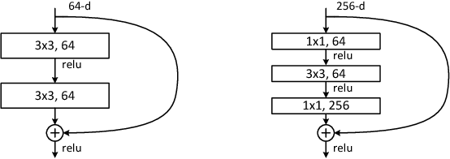

# ResNet



## Overview
This is an unofficial PyTorch implementation of the following paper:

> **Deep Residual Learning for Image Recognition** <br>
> Kaiming He, Xiangyu Zhang, Shaoqing Ren, Jian Sun <br>
> https://arxiv.org/pdf/1512.03385.pdf

## TODO
- [ ] Add RGB color shift for augmentation.
- [ ] 10 crops prediction on validation.

## Usage
Following command train the model
```bash
accelerate launch train.py
```

## Experiments
All models were trained with the default parameters except model architecture.

| Model | Top-1 acc. | Top-5 acc. |
| ---   |     :---:      |   :---: |
| ResNet-18   |      |     |
| ResNet-34   |      |     |
| ResNet-50   |   72.4   |   91.0  |
| ResNet-101   |   75.6   |   92.6  |
| ResNet-152 | 76.1 | 92.8 |
