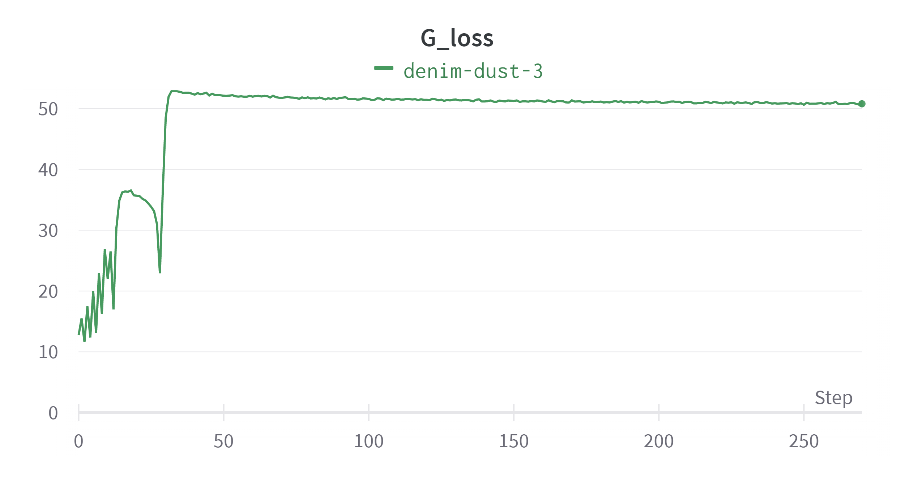
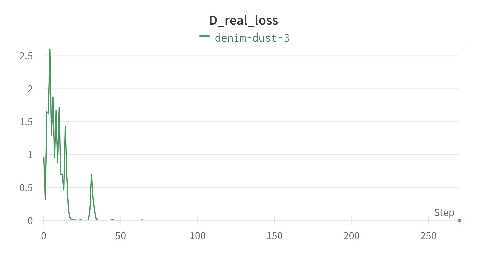
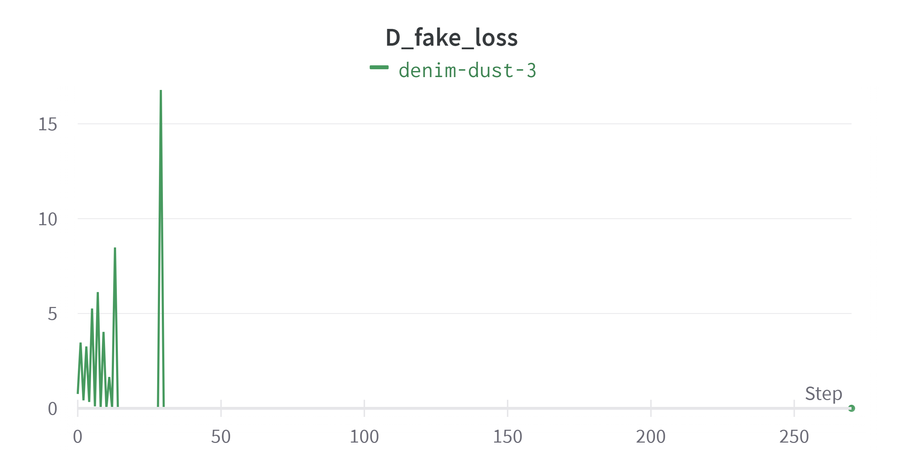

# DCGAN
## Overview
This is an unofficial PyTorch implementation of the following paper:

> **Unsupervised Representation Learning with Deep Convolutional Generative Adversarial Networks** 
> Alec Radford, Luke Metz, Soumith Chintala  
> https://arxiv.org/abs/1812.04948

## Results
The figures show each loss of training with one GPU.

</img>
</img>
</img>
