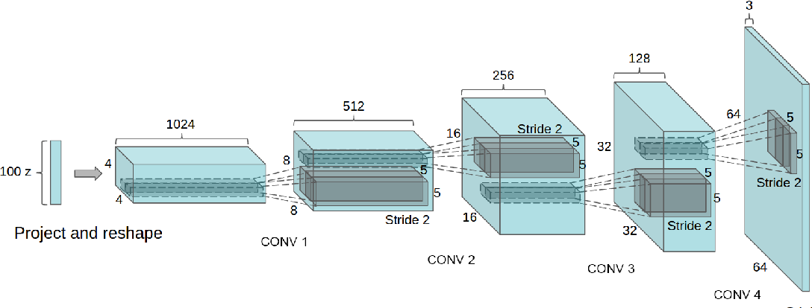
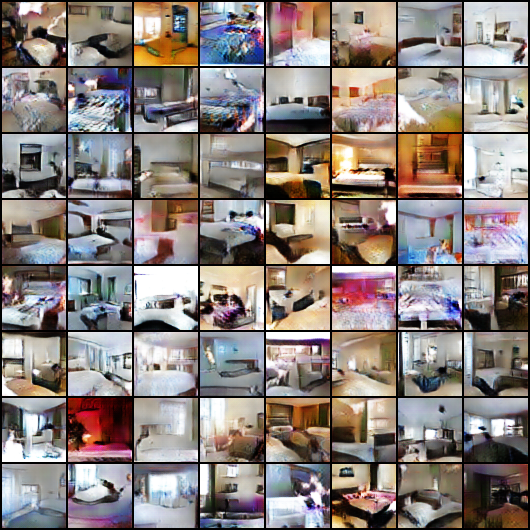

# DCGAN



## Overview
This is an unofficial PyTorch implementation of the following paper:

> **Unsupervised Representation Learning with Deep Convolutional Generative Adversarial Networks**<br>
> Alec Radford, Luke Metz, Soumith Chintala <br>
> https://arxiv.org/abs/1812.04948

## Usage
The following command trains the model.
```bash
accelerate launch train.py
```

## Results
The figure is generated by DCGAN trained with LSUN bedroom dataset.


