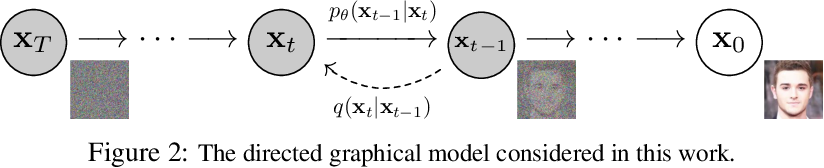

# DCGAN



## Overview
This is an unofficial PyTorch implementation of the following paper:

> **Denoising Diffusion Probabilistic Models**<br>
> Jonathan Ho, Ajay Jain, Pieter Abbeel<br>
> https://arxiv.org/abs/2006.11239

## Usage
The following command trains the model.
```bash
accelerate launch train.py
```

## Results
