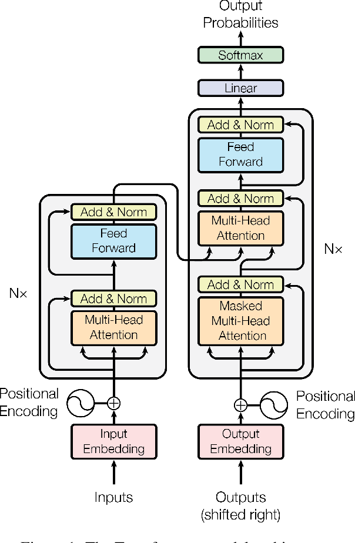

# Transformer



## Overview
This is an unofficial PyTorch implementation of the following paper:

> **Attention Is All You Need** <br>
> Ashish Vaswani, Noam Shazeer, Niki Parmar, Jakob Uszkoreit, Llion Jones, Aidan N. Gomez, Lukasz Kaiser, Illia Polosukhin <br>
> https://arxiv.org/pdf/1706.03762.pdf

## Example
```python
import torch
from transformer import Transformer

model = Transformer()
inputs = torch.rand(4, 30, 512).chunk(2)
print(model(*inputs).shape)
```
