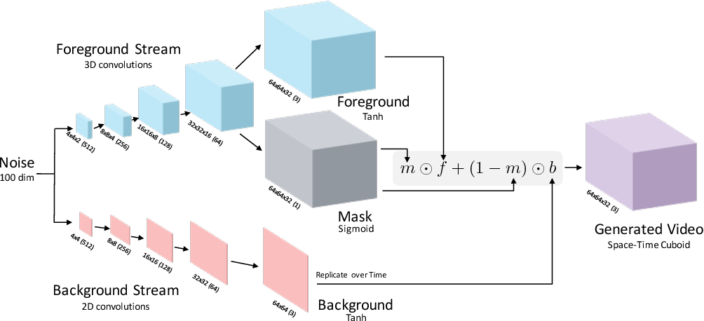
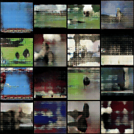
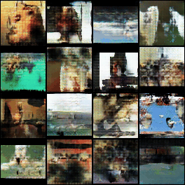

# VGAN
</img>
## Overview
This is an unofficial PyTorch implementation of the following paper:

> **Unsupervised Representation Learning with Deep Convolutional Generative Adversarial Networks**<br>
> Alec Radford, Luke Metz, Soumith Chintala <br>
> https://arxiv.org/abs/1812.04948

## Usage
Following command train the model
```bash
accelerate launch train.py
```

## Results
Train a VGAN with UCF-101 dataset.
The following videos are generated at 100 and 200 epochs.

100 epoch



200 epoch


